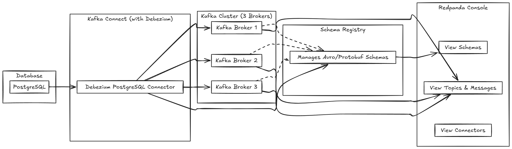

Here's a well-structured `README.md` file based on your Docker Compose setup and instructions:

---

# Kafka Connect Exploration with Docker Compose


This project sets up a complete Kafka ecosystem with PostgreSQL and Kafka Connect using Docker Compose. It allows you to stream changes from a Postgres table to a Kafka topic and visualize them using Redpanda Console.

## 🔧 Prerequisites

* Docker and Docker Compose installed
* IntelliJ IDEA (for PostgreSQL datasource and SQL interaction)
* Postman (for Kafka Connect API requests)

---

## 🚀 Running the Environment

To start all services:

```bash
docker-compose up -d
```

Once started, verify that **all containers are up and running**:

```bash
docker ps
```

Look for containers like:

* zookeeper-1, zookeeper-2, zookeeper-3
* broker-1, broker-2, broker-3
* schema-registry
* connect
* redpanda-console
* postgres-db

---

## 💾 Connecting to PostgreSQL in IntelliJ

1. Open IntelliJ IDEA.
2. Go to **Database** tool window > **+** > **Data Source** > **PostgreSQL**.
3. Enter the following configuration:

    * **Host:** `localhost`
    * **Port:** `5432`
    * **Database:** `dbconnect`
    * **User:** `dbconnect`
    * **Password:** `123`
4. Click **Test Connection** and then **OK** if successful.

---

## 🧱 Creating the Table

Once connected, run this SQL in IntelliJ's Database Console:

```sql
CREATE TABLE KAFKA_CONNECT (
    id SERIAL PRIMARY KEY,
    fullname TEXT NOT NULL,
    created_at TIMESTAMP DEFAULT CURRENT_TIMESTAMP
);
```

---

## 📬 Importing Postman Collection and Creating Connector

1. Open **Postman**.
2. Click **Import** and choose the file: `kafka-connect-exploration.postman_collection.json`.
3. Inside the imported collection:

    * Run **POSTGRES - Create postgres db connector**.
    * Check status with **POSTGRES Connector Status** to ensure it's `RUNNING`.

---

## 🔢 Inserting Test Data

Back in IntelliJ, open a new SQL Console and run:

```sql
INSERT INTO KAFKA_CONNECT (fullname) VALUES ('Alice Johnson');
INSERT INTO KAFKA_CONNECT (fullname) VALUES ('Bob Smith');
INSERT INTO KAFKA_CONNECT (fullname) VALUES ('Charlie Davis');
```

You can use current timestamps or provide specific ones if needed.

---

## 🔍 Visualizing with Redpanda Console

1. Visit [http://localhost:8080](http://localhost:8080).
2. Browse:

    * Kafka topics
    * Message content
    * Schemas
    * Connectors

Check if your topic (e.g., `dbconnect.public.kafka_connect`) is populated with the inserted data.

---

## 🧼 Cleanup

To stop and remove all containers and volumes:

```bash
docker-compose down -v
```

---

## 📁 Project Structure Overview

```
├── docker-compose.yml
├── kafka-connect-exploration.postman_collection.json
└── debezium-connector-postgres/
```
---

